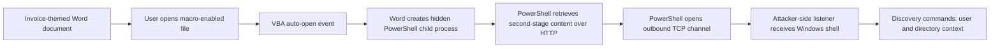

# Malicious Word Macro Attack Chain Research

[](#scope-and-safety)
[](docs/01-attack-chain.md#mitre-attck-mapping)
[](#observed-attack-chain)
[](#observed-attack-chain)

A defensive deep dive into a classic malicious Microsoft Word/VBA delivery chain:

> **Lure document → VBA auto-open macro → hidden PowerShell → staged second-stage script → outbound reverse connection → interactive Windows shell**

The repository documents the technique shown in a 17-frame demonstration, explains the attacker tooling, maps the behavior to MITRE ATT&CK, and provides detection, hardening, incident-response, and safe-lab material.

## Scope and safety

This repository is intentionally **non-weaponized**:

- No working reverse-shell payload is included.
- No deployable malicious `.docm` file is included.
- No command-and-control configuration is included.
- The VBA shown in the source demonstration is not transcribed into runnable form.
- Test IP addresses in mock telemetry use RFC 5737 documentation ranges.
- The included VBA sample only writes a local benign marker file and does not spawn processes or use the network.

Use this material only for authorized security research, detection engineering, incident response, and controlled lab training.

## Important modern-context note

The demonstration represents a well-known macro attack pattern, but it simplifies the behavior of current Microsoft 365 Apps. On supported Windows Office builds, VBA macros in files carrying Mark of the Web are blocked by default. A successful modern attack therefore commonly depends on a bypass condition such as unsafe policy configuration, removal of Mark of the Web, a trusted location, a trusted publisher, legacy Office behavior, or another delivery method.

This is one of the most important distinctions between a short proof-of-concept video and a real enterprise intrusion.

## Observed attack chain



### Likely process tree

```text
explorer.exe / email client / browser
└── WINWORD.EXE
    └── powershell.exe or pwsh.exe
        ├── outbound HTTP connection to staging service
        ├── outbound TCP connection to listener or C2
        └── cmd.exe
            ├── whoami
            └── dir
```

### Stage-by-stage summary

| Stage | What happens | Observable evidence |
|---|---|---|
| Delivery | An invoice-themed macro-enabled document is supplied to the target. | Email attachment, download event, `.docm`/`.dotm`, Mark of the Web |
| User execution | The user opens the document and permits active content in a weakly configured or legacy environment. | `WINWORD.EXE`, Office security events, trusted-document changes |
| VBA execution | `AutoOpen` or `Document_Open` invokes a trigger routine. | VBA streams, auto-run keywords, AMSI inspection |
| PowerShell staging | Word launches PowerShell, often with a hidden window. | Office → PowerShell parent-child chain, command line, Event ID 4688/Sysmon 1 |
| Tool transfer | PowerShell retrieves a second-stage script from a temporary web server. | HTTP request, PowerShell script block logs, Sysmon 3, proxy logs |
| Command channel | The script initiates an outbound connection to a listening system. | Unusual remote IP/port, PowerShell network connection |
| Shell access | A Windows command shell is returned over the channel. | `cmd.exe` spawned by PowerShell, interactive command sequence |
| Discovery | The operator identifies the current user and enumerates files. | `whoami`, `dir`, T1033, T1083 |

## Tooling shown in the demonstration

| Tool or component | Role |
|---|---|
| Microsoft Word | Hosts the lure and VBA project |
| Visual Basic for Applications | Auto-execution and first-stage orchestration |
| PowerShell | Native Windows script interpreter and second-stage loader |
| .NET networking classes | HTTP retrieval from the staging server |
| Powercat-style script | PowerShell implementation of a TCP shell/channel |
| Python HTTP server | Temporary payload staging |
| Netcat/Ncat | Attacker-side TCP listener |
| Kali Linux | Attacker/lab workstation |
| Private lab subnet | Isolated connectivity between attacker and victim VMs |

The screenshots specifically show a `powercat.ps1` file, a Python-based HTTP server, and a Netcat listener. Real intrusions may substitute custom loaders, commercial or open-source C2 frameworks, cloud-hosted staging, compromised websites, or living-off-the-land binaries.

## High-signal detection logic

The strongest generic signal is not the document name or destination port. It is the **process lineage**:

```text
WINWORD.EXE → powershell.exe/pwsh.exe → cmd.exe
```

Additional high-value signals:

- Office spawning PowerShell, Command Prompt, WScript, CScript, MSHTA, Rundll32, Regsvr32, or install utilities.
- PowerShell launched with hidden-window, encoded-command, download, reflection, or in-memory execution patterns.
- PowerShell making network connections immediately after Word starts.
- A newly opened macro-enabled Office file followed by script-interpreter execution.
- PowerShell or `cmd.exe` performing `whoami`, `dir`, `systeminfo`, `ipconfig`, or similar discovery.
- Office files from email or browser downloads whose Mark of the Web was removed.
- ASR audit/block events for Office child processes or executable content.

See:

- [Attack-chain analysis](docs/01-attack-chain.md)
- [Attacker tooling](docs/02-attacker-tooling.md)
- [Detection engineering](docs/03-detection-engineering.md)
- [Hardening](docs/04-hardening.md)
- [Incident response](docs/05-incident-response.md)
- [Safe lab](docs/06-safe-lab.md)
- [Screenshot walkthrough](docs/07-screenshot-walkthrough.md)
- [Microsoft Defender XDR KQL](detections/kql/microsoft-defender-xdr.kql)
- [Sigma rules](detections/sigma/)
- [YARA rule](detections/yara/suspicious_office_vba_strings.yar)

## MITRE ATT&CK mapping

| Technique | ID | Demonstrated behavior |
|---|---|---|
| Spearphishing Attachment | T1566.001 | Malicious Office attachment as delivery vector |
| User Execution: Malicious File | T1204.002 | Victim opens the document |
| Command and Scripting Interpreter: Visual Basic | T1059.005 | VBA macro execution |
| Command and Scripting Interpreter: PowerShell | T1059.001 | PowerShell loader and second stage |
| Hide Artifacts: Hidden Window | T1564.003 | Hidden PowerShell execution |
| Ingress Tool Transfer | T1105 | Second-stage script retrieved from staging server |
| Non-Application Layer Protocol | T1095 | Raw TCP-style reverse channel |
| Command and Scripting Interpreter: Windows Command Shell | T1059.003 | Interactive `cmd.exe` shell |
| System Owner/User Discovery | T1033 | `whoami` |
| File and Directory Discovery | T1083 | `dir` |

## Repository layout

```text
.
├── README.md
├── DISCLAIMER.md
├── NOTICE.md
├── SOURCES.md
├── docs/
│   ├── 01-attack-chain.md
│   ├── 02-attacker-tooling.md
│   ├── 03-detection-engineering.md
│   ├── 04-hardening.md
│   ├── 05-incident-response.md
│   ├── 06-safe-lab.md
│   └── 07-screenshot-walkthrough.md
├── detections/
│   ├── kql/
│   ├── sigma/
│   └── yara/
├── samples/
│   ├── benign-vba/
│   └── mock-telemetry/
└── scripts/
    └── Test-OfficeMacroAttackSurface.ps1
```

## Safe document triage

Do not double-click a suspicious document on a production workstation. Preserve it and analyze it in an isolated environment.

Useful defensive tools include:

- `olevba` from `oletools`
- `oledump.py`
- `OfficeMalScanner`
- YARA
- Microsoft Defender Antivirus and AMSI
- Sysmon
- Microsoft Defender for Endpoint
- Procmon and Process Explorer
- Wireshark or a controlled network simulator

Example static-analysis workflow:

```text
1. Record SHA-256.
2. Preserve the original file and its Zone.Identifier stream.
3. Extract or enumerate VBA streams without opening the document in Office.
4. Search for auto-run functions, process creation, network APIs, and obfuscation.
5. Detonate only in a disposable, isolated VM with no production credentials.
6. Correlate document, process, script, file, and network telemetry.
```

## Screenshot examples

The 17 screenshots are original, author-owned research material created by Dewald Pretorius and are used as illustrative examples throughout this repository.

## Further reading

See [SOURCES.md](SOURCES.md) for Microsoft and MITRE primary references.
